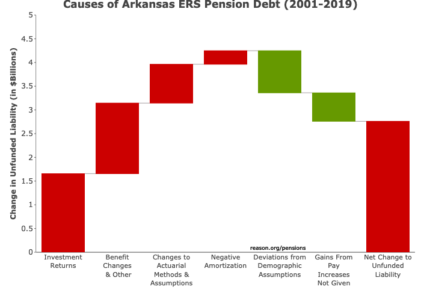

```{r setup, include=FALSE}
knitr::opts_chunk$set(
  echo = FALSE,
  message = FALSE,
  warning = FALSE,
  #dev = "svg",
  fig.width = 12,
  fig.height = 7
  #Font size (Graphs + Text)
  #Source line
  #Header
)
#Update linePlot() for Treasury functionality
#Update linePlot() for shaded UAL area/line plot
#Create glPlot() w/ function to turn "interactive" parameter TRUE/FALSE to create Plotly graph (eventually use database data)
#Create barPlot() w/ manual ready data + database calculated Neg.Amo + interest on Debt
#
```
 
### About the Pension Integrity Project

We offer pro-bono technical assistance to public officials to help them design and implement pension reforms that improve plan solvency and promote retirement security, including: </p>
- Customized analysis of pension system design, trends </p>
- Independent actuarial modeling of reform scenarios </p>
- Consultation and modeling around custom policy designs </p>
- Latest pension reform research and case studies </p>
- Peer-to-peer mentoring from state and local officials who have successfully enacted pension reforms </p> 
- Assistance with stakeholder outreach, engagement and relationship management </p>
- Design and execution of public education programs and media campaigns </p>

### A History of Weakening Solvency (2001-2019) w/ R (areaPlot())
```{r debt, fig.width=8, fig.height=5, fig.align = "center", message=FALSE, warning=FALSE}

rm(list=ls())
###Load/install packages
#R.Version()
#https://github.com/ReasonFoundation/pensionviewr
#Create token -> usethis::edit_r_environ() -> restart -> Sys.getenv("GITHUB_PAT")
#install.packages('devtools')
#library(devtools)
#devtools::install_github("ReasonFoundation/reasontheme",force = TRUE)
#devtools::install_github("ReasonFoundation/pensionviewr", force = TRUE)
library(reasontheme)
library(pensionviewr)
library(ggplot2)
library(tidyverse)
library(tseries)
library(data.table)
library(readr)
library(rsconnect)
library(dplyr)
library(plyr)

###
##Pull PERSI data
##Load list of plans
pl <- planList()

#PULL DATA
Data <- pullStateData(2001)
Data <- filterData(Data,2001)
Data <- Data %>% filter(year < 2020)

#View(Data)
PERSI.debt <- Data %>% filter(plan_name == "Idaho Public Employee Retirement System")
PERSI.debt$year <- as.numeric(PERSI.debt$year)
PERSI.debt$ava <- as.numeric(PERSI.debt$ava)
PERSI.debt$aal <- as.numeric(PERSI.debt$aal)

debt <- areaPlot (PERSI.debt, caption = F, grid = F, ticks = F, sp500 = F, font = "Calibri")

debt
```

### Causes of Pension Debt (2001-2019) w/ R (custom Plotly-Image)
```{r}
     ########## Arkansas PERS Dashboard ##########
##Data: Manually Collected
##By: Anil, Jordan, Swaroop

### Clean Global Environment ###
rm(list = ls())

#devtools::install_github("ReasonFoundation/reasontheme",force = TRUE)
### Load Packages ###
#install.packages('devtools')
#library(devtools)
#devtools::install_github("ReasonFoundation/reasontheme",force = TRUE)
#devtools::install_github("ReasonFoundation/pensionviewr", force = TRUE)
#install.packages("data.table")
library(pensionviewr)
library(tseries)
library(data.table)
library(openxlsx)
library(readr)
library(rsconnect)
library(ggplot2)
library(tidyverse)
library(shiny)
library(shinyWidgets)
library(shinydashboard)
library(htmlwidgets)
library(DT)
library(plotly)
library(plyr)
library(dplyr)
library(orca)
library(png)

### Arkansas PERS Data ###

glPlot <- function(
      url = "https://raw.githubusercontent.com/ReasonFoundation/databaseR/master/apps/APERS_GL.csv", 
      interactive = FALSE, fileName = "Gain/Loss.png",
      title = "<b>Causes of Arkansas ERS Pension Debt (2001-2019)<b>",
      caption = FALSE,
      lab1 = "Investment<br>Returns", 
      lab2 = "Benefit<br>Changes<br> & Other",
      lab3 = "Changes to<br>Actuarial<br>Methods &<br>Assumptions", 
      lab4 = "Negative<br>Amortization",
      lab5 = "Deviations from<br>Demographic<br>Assumptions",
      lab6 = "Gains From<br>Pay<br>Increases<br>Not Given",
      lab7 = "Net Change to<br>Unfunded<br>Liability"){
  
  #[1] Load Gain/Loss data from the provided url
  urlfile=url
  data <- read_csv(url(urlfile), col_names = TRUE, na = c(""), skip_empty_rows = TRUE, col_types =       NULL)
  data <- as.data.table(data)# convert to data.table
  
  #[2] Calculate Total Gain/Loss for each column (i.e. Net Change to UAL over the years)
    y = data[,lapply(.SD,sum),.SDcols=colnames(data)]*1e-6
    y = y[,!1]# sum values by each column
    y = t(y)#Saving needed columns and transposing table for graphics
  
  #[3] Combine gain/loss data & categories to create interactive Waterfall chart w/ plotly
    x = list(lab1, lab2, lab3, lab4, lab5, lab6, lab7)

    measure= c("relative",
               "relative",
               "relative",
               "relative",
               "negative",
               "negative",
               "total")
    
    data <- data.frame(x = factor(x, levels = x), measure, y)
    #View(data)
    #  m <- list(
    #  l = 50,
    #  r = 0,
    #  b = 0,
    #  t = 50,
    #  pad = 4
    #  )
    data <- data.frame(data)
   
    #[4] Visualizing with Plotly
    fig <- plot_ly( data,
                    type = "waterfall",
                    measure = ~measure,
                    x = ~x,
                    textposition = "outside",
                    y= ~y,
                    decreasing = list(marker = list(color = palette_reason$Green)),
                    increasing = list(marker = list(color = palette_reason$Red)),
                    totals = list(marker = list(color = palette_reason$Red)),
                    connector = list(line = list(color= palette_reason$SpaceGrey, width = 1))) 
    
    fig <- fig %>%
      layout(title = paste0(title),
             xaxis = list(title = "",tickfont = list(size = 11, face = "bold")),
             yaxis = list(title = "<b>Change in Unfunded Liability (in $Billions)<b>",
                          titlefont = list(size = 12), range = c(0,5),
                          showgrid = FALSE,
                          tick0 = 0,
                          dtick = 0.5,
                          ticklen = 2,
                          linecolor = '#636363',
                          linewidth = 0.75),
             barmode = 'stack',
             autosize = F,
            #width = 700, height = 450, margin = m,
             showlegend = F)
      
      #ADD caption
      if(isTRUE(caption)){
      fig <- fig %>% 
                   layout(annotations = list(yref = 'paper', xref = "x", showarrow = F, 
                    y = 0, x = 4.5, text = "reason.org/pensions",
                    xanchor='right', yanchor='auto', xshift=0, yshift=0,
                    font=list(size=9, color="black")))}
    
    #`Save` as a `static` png file 
    #OR `show` as a `interactive` Plotly chart
    if(!isTRUE(interactive)){
    #Save Plotly as a Static PNG on a local computer (to reference in rmarkdown later)
    #https://github.com/plotly/orca
    orca(fig, paste0(fileName))}else{fig}
}

glPlot(url = "https://raw.githubusercontent.com/ReasonFoundation/databaseR/master/apps/APERS_GL.csv",       interactive = F,
      fileName = "Gain/Loss.png",
      title = "<b>Causes of Arkansas ERS Pension Debt (2001-2019)<b>",
      caption = TRUE,
      lab1 = "Investment<br>Returns", 
      lab2 = "Benefit<br>Changes<br> & Other",
      lab3 = "Changes to<br>Actuarial<br>Methods &<br>Assumptions", 
      lab4 = "Negative<br>Amortization",
      lab5 = "Deviations from<br>Demographic<br>Assumptions",
      lab6 = "Gains From<br>Pay<br>Increases<br>Not Given",
      lab7 = "Net Change to<br>Unfunded<br>Liability")

```


### Make up of Pension Contributions w/ R (custom)
```{r}
rm(list=ls())

library(reasontheme)
library(pensionviewr)
library(ggplot2)
library(tidyverse)
library(tseries)
library(data.table)
library(readr)
library(rsconnect)
library(dplyr)
library(plyr)
library(DT)
library(scales)

###
##Pull PERSI data
##Load list of plans
pl <- planList()

#PULL DATA
Data <- pullStateData(2001)
Data <- filterData(Data,2001)
Data <- Data %>% filter(year < 2020 & year > 2018)

#View(Data)
Data <- Data %>% filter(plan_name == "Idaho Public Employee Retirement System")
#View(Data)
plan.name <- c("PERSI")

#Create table skeleton
table <- matrix(NA,7,3)
table[3:7,1] <- c("Total Employee", 
               "Employer (Normal Cost)", 
               "Employer (Debt Amortization)", 
               "Total Employer", 
               paste0("Total ", plan.name, " Contributions"))

#Use database numbers to populate/calculate needed values
table[2,2] <- c("% of payroll")
table[2,3] <- c("$ Value")
table[3,2] <- as.numeric(Data$ee_nc_pct)
table[3,3] <- as.numeric(Data$ee_contribution)
table[4,2] <- as.numeric(Data$total_nc_pct)-as.numeric(Data$ee_nc_pct)
table[4,3] <- as.numeric(table[4,2]) * as.numeric(Data$payroll)
table[5,2] <- as.numeric(Data$total_amortization_payment_pct)
table[5,3] <- as.numeric(Data$total_amortization_payment_pct) * as.numeric(Data$payroll)
table[6,2] <- sum(as.numeric(table[4:5,2]))
table[6,3] <- sum(as.numeric(table[4:5,3]))
table[7,2] <- as.numeric(Data$total_nc_pct)+as.numeric(Data$total_amortization_payment_pct)
table[7,3] <- as.numeric(Data$total_contribution)

table <- data.table(table)
colnames(table) <- c("Name", "Payroll", "Value")
table <- table[3:7,]
table$Value <- as.numeric(table$Value)
table$Payroll <- as.numeric(table$Payroll)

#Format data to %/$ for appearance
table[,3] <- scales::dollar(table$Value)
table[,2] <- scales::percent(table$Payroll, accuracy = 0.1)
colnames(table) <- c("", "% of Payroll", "$ Value")

#View(table)
#Knit the table
knitr::kable(
  table, caption = 'Pension Integrity Project pension database.'
)
```

### A History of Investment Returns (2001-2020) w/ R (linePlot())
```{r graph, fig.width=8, fig.height=5, fig.align = "center", message=FALSE, warning=FALSE}
### linePlot ###
## Data: Database + Manual(AVA returns)
## Base: linePlot() function in `pensionviewr`
# By: Anil, Swaroop, and Jen

##linePlot() function parameters:

#data = data in data.frame, tibble, or data.table format,
#yaxisMin & yaxisMax = Y-axis mininum and maximum values
#yaxisSeq = set sequency of Major breaks
#yaxisScale = 100 for percentages
#format = set Y-axis format to either "%", "$", or empty
#str = set number of srings at which to cut legend text (default is 20),
#labelY = title of Y-axis,
#lab1 - lab5 = character string of line titles/names (default is 0 Lines)

###################
#Using 2 New Functions to download and filter datat from datatabase
PERSI.data <- pullStateData(2001)
PERSI.data <- filterData(PERSI.data, 2001)
PERSI.data<- PERSI.data %>% filter (plan_name == "Idaho Public Employee Retirement System")
#View(PERSI.data)
PERSI.data$year <- as.numeric(PERSI.data$year)
#Set to data.frame for visualization
PERSI.data <- data.frame(PERSI.data)
#View(PERSI.data)
# UAL4 <- data.table(UAL4[, Tr30 := tr30[(n-UAL4[!is.na(Actual_Return),.N]):last]])
###############
#Adding AVA returns (Arkansas ERS example*)
ava_returns <- matrix(0, 20,1)
ava_returns[,1] <- c(-0.064, -0.0736, 0.0332, 0.1763, 4.70, 9.00, 12.40, 8.00, -5.90, 2.00, 3.10, 4.50, 11.40, 13.80, 8.80, 8.20, 7.70, 5.80, 6.50, 3.5)
#View(ava_returns)
ava_returns <- data.table(ava_returns/100)

PERSI.data <- data.table(PERSI.data)
PERSI.data <- PERSI.data[, ava_return := ava_returns]
PERSI.data$year <- as.numeric(PERSI.data$year)
PERSI.data <- PERSI.data %>% select(year, return_1yr, ava_return, arr, dr)
PERSI.data$year <- as.numeric(PERSI.data$year)

#####Modified linePlot

#Inv. Returns      
graph <- linePlot(PERSI.data, title = "", inv.returns = TRUE, treasury = FALSE,
                  font = "Calibri", yaxisMin = -21, yaxisMax = 21, yaxisSeq = 3,
                  yaxisScale = 100, format = "%", str = 60,
                  labelY = "", lab1 = "Market Valued Returns (Actual)", 
                  lab2 = "Actuarially Valued Investment Return (Smoothed by Plan)", 
                  lab3 = "Assumed Rate of Return", lab4 = "10-Year Geometric Rolling Average")

#Alternative DR vs. 30-Year TTreasury
#graph <- linePlot(PERSI.data, title = "", inv.returns = FALSE, treasury = TRUE,
#                  font = "Calibri", yaxisMin = 0, yaxisMax = 9, yaxisSeq = 1,
#                  yaxisScale = 100, format = "%", str = 60,
#                  labelY = "", lab1 = "Actual Discount Rate", 
#                  lab2 = "30-Year Treasury Bond Yield Rate", 
#                  lab3 = "Alternative Discount Rate")
#graph
#Example w/ AVA vs. AAL
#PERSI.data <- PERSI.data %>% select(year, ava, aal)
#graph <- linePlot(PERSI.data, title = "", inv.returns = FALSE, treasury = FALSE,
#                  font = "Calibri",
#                  yaxisMin = 0, yaxisMax = 21, yaxisSeq = 3,
#                  yaxisScale = 1/1000000000, format = "$", str = 60,
#                  labelY = "AVA vs. AAL", lab1 = "Actuarial Value of Assets", 
#                  lab2 = "Actuarial Accrued Liabilities")


graph
```

### S&P500 vs. Funded Ratio (2001-2019) w/ R (areaPlot())
```{r sp500, fig.width=8, fig.height=5, fig.align = "center", message=FALSE, warning=FALSE}
rm(list=ls())
###Load/install packages
#R.Version()
#https://github.com/ReasonFoundation/pensionviewr
#Create token -> usethis::edit_r_environ() -> restart -> Sys.getenv("GITHUB_PAT")
#install.packages('devtools')
#library(devtools)
#devtools::install_github("ReasonFoundation/reasontheme",force = TRUE)
#devtools::install_github("ReasonFoundation/pensionviewr", force = TRUE)
library(reasontheme)
library(pensionviewr)
library(ggplot2)
library(tidyverse)
library(tseries)
library(data.table)
library(readr)
library(rsconnect)
library(dplyr)
library(plyr)

###
##Pull PERSI data
##Load list of plans
pl <- planList()

#PULL DATA
Data <- pullStateData(2001)
Data <- filterData(Data,2001)
Data <- Data %>% filter(year < 2020)

PERSI.debt <- Data %>% filter(plan_name == "Idaho Public Employee Retirement System")
PERSI.debt$year <- as.numeric(PERSI.debt$year)
PERSI.debt$ava <- as.numeric(PERSI.debt$ava)
PERSI.debt$aal <- as.numeric(PERSI.debt$aal)

sp500 <- areaPlot (PERSI.debt, caption = F, grid = F, ticks = F, sp500 = T, font = "Calibri")

sp500
```

### Asset Allocation (2001-2019) w/ R (custom)
```{r assets, fig.width=8, fig.height=5, fig.align = "center", message=FALSE, warning=FALSE}

plotTheme <- ggplot2::theme(   panel.grid.major = element_blank(),
                               panel.grid.minor = element_blank(), axis.line = element_line(colour = "black"),
                               plot.margin = margin(1, 1,0,0, "cm"),
                               axis.text.y = element_text(size=9, color = "black"),
                               axis.text.x = element_text(size=9, color = "black", angle = 0, hjust = 0.5, vjust = 0),
                               legend.title = element_text(size = 9, colour = "white", face = "bold"))


#Load Asset Allocation data for PERSI
urlfile2="https://raw.githubusercontent.com/ReasonFoundation/GraphicsR/master/R/PERSI.Asset.Alloc.csv"
PERSI.assets <- data.table(read_csv(url(urlfile2), col_names = TRUE, na = c(""), skip_empty_rows = TRUE, col_types = cols(.default = "n")))
PERSI.assets <- data.table(PERSI.assets)
#Adding Othe to Alternatives
PERSI.assets$alternatives <- PERSI.assets$alternatives+ PERSI.assets$other
PERSI.assets <- PERSI.assets %>% select(year, real.estate, alternatives, equity, fixed.income, cash)
colnames(PERSI.assets) <- c("year", "Real Rstate", "Alternatives", "Total Equities", "Fixed Income", "Cash Equivalents")

#View(PERSI.assets)
#Transpose data from long ot wide format (each year contains Variable & Value)
PERSI.assets <- melt(PERSI.assets, id.vars="year")

assets <- ggplot(PERSI.assets) + geom_area(aes(x = year, y = value, fill = variable, group = variable), position="fill")+
  scale_fill_manual(values=c(palette_reason$Yellow,palette_reason$Orange, 
                             palette_reason$DarkGrey, palette_reason$LightBlue, palette_reason$SatBlue))+
  scale_y_continuous(labels = function(x) paste0(x*100,"%"), name = "% of Investment Portfolio",
                     breaks = seq(0, 1, by = 0.1), limits = c(0, 1), expand=c(0,0))+
  scale_x_continuous(labels = function(x) paste0(x, ""), name = "",
                     breaks = seq(2001, 2019, by = 2), limits = c(2001, 2019), expand=c(0,0))+
  theme_bw()+
  plotTheme+
  theme(legend.position="bottom")

assets
```

### Change in Risk-Free Rate vs. Discount Rate (2001-2019) w/ R (linePlot())
```{r treasury, fig.width=8, fig.height=5, fig.align = "center", message=FALSE, warning=FALSE}
### linePlot ###
## Data: Database + Manual(AVA returns)
## Base: linePlot() function in `pensionviewr`
# By: Anil, Swaroop, and Jen

##linePlot() function parameters:

#data = data in data.frame, tibble, or data.table format,
#yaxisMin & yaxisMax = Y-axis mininum and maximum values
#yaxisSeq = set sequency of Major breaks
#yaxisScale = 100 for percentages
#format = set Y-axis format to either "%", "$", or empty
#str = set number of srings at which to cut legend text (default is 20),
#labelY = title of Y-axis,
#lab1 - lab5 = character string of line titles/names (default is 0 Lines)

###################
#Using 2 New Functions to download and filter datat from datatabase
PERSI.data <- pullStateData(2001)
PERSI.data <- filterData(PERSI.data, 2001)

pl <- planList()
#filter for PERSI
PERSI.data<- PERSI.data %>% filter (plan_name == "Idaho Public Employee Retirement System")
#View(PERSI.data)

PERSI.data$year <- as.numeric(PERSI.data$year)
PERSI.data <- PERSI.data %>% select(year, dr)
#Set to data.frame for visualization
PERSI.data <- data.frame(PERSI.data)
#View(PERSI.data)
#####Modified linePlot

linePlot <- function (data, title = NULL, caption = FALSE, grid = FALSE, 
                      treasury = FALSE, inv.returns = TRUE, ticks = TRUE, font = NULL,
                      yaxisMin = 0, yaxisMax = NULL, yaxisSeq = 5, 
                      yaxisScale = 100, format = NULL, str = 20, labelY = NULL, 
                      lab1 = NULL, lab2 = NULL, lab3 = NULL, lab4 = NULL, lab5 = NULL) 
{
  reasontheme::set_reason_theme(style = "slide")
  
   x <- length(data$year)
   data <- data.frame(data) %>% dplyr::mutate_all(dplyr::funs(as.numeric))
  
   ###TREASURY
  
   if(isTRUE(treasury)){
   urlfile <- "https://raw.githubusercontent.com/ReasonFoundation/databaseR/master/files/treasury.csv"
treasury <- read_csv(url(urlfile), col_names = TRUE, na = c(""), skip_empty_rows = TRUE, col_types = NULL)
treasury <- data.table(
  treasury %>% filter(year >= min(data$year)))
data <- data %>% select(year, dr)

  data <- data.table(data)
  data <- cbind(data, treasury[,2])
  data <- data.frame(data) %>% dplyr::mutate_all(dplyr::funs(as.numeric))
data <- data.table(data)
data[,alt.discount := NA]
diff <- (data[year == min(data$year)]$dr - data[year == min(data$year)]$`X30.treasury`)
data$alt.discount <- data$`X30.treasury` + diff

lineColors <- c(palette_reason$SatBlue, palette_reason$LightOrange, palette_reason$Green)
  }
  
     #Geomean function
  geomean <- function(x) {
    x <- as.vector(na.omit(x))
    x <- x + 1
    exp(mean(log(x))) - 1
  }
  
  if (isTRUE(inv.returns)) {
    data$return_1yr <- as.numeric(data$return_1yr)
    returns <- as.numeric(data$return_1yr)
    nyear <- 10
    rolling <- geomean(returns[1:nyear])
    n <- length(na.omit(returns)) - nyear
    for (i in 1:n) {
      rolling <- rbind(rolling, geomean(returns[(i + 1):(i + nyear)]))
    }
    data <- data.table(data)
    rolling <- data.table(rolling)
    data <- data.table(rbind.fill(rolling, data))
    data[(x + 1):(x + rolling[, .N])]$V1 <- data[(1:rolling[, .N])]$V1
    data <- data.table(data)
    data <- data[!(1:rolling[, .N])]
    data <- data %>% select(year, return_1yr, ava_return, 
                            arr, V1)
    lineColors <- c(palette_reason$Orange, palette_reason$Yellow,palette_reason$SatBlue, palette_reason$LightGrey, palette_reason$LightGreen)
  }
  
  colnames(data) <- c("year", if (!is_null(lab1)) {
    paste(lab1)
  }, if (!is_null(lab2)) {
    paste(lab2)
  }, if (!is_null(lab3)) {
    paste(lab3)
  }, if (!is_null(lab4)) {
    paste(lab4)
  }, if (!is_null(lab5)) {
    paste(lab5)
  })
  
  graph <- data.table(melt(data, id.vars = "year"))
  
  options(repr.plot.width = 1, repr.plot.height = 0.75)
  ggplot2::ggplot(graph, ggplot2::aes(x = year, y = yaxisScale * 
                                        value, group = variable)) + ggplot2::geom_line(ggplot2::aes(colour = str_wrap(factor(variable), 
                                                                                                                      str)), size = 1.5) + ggplot2::geom_hline(yintercept = 0, 
                                                                                                                                                               color = "black") + ggplot2::scale_colour_manual(values = lineColors) + 
    ggplot2::scale_y_continuous(breaks = seq(yaxisMin, if (!is.null(yaxisMax)) {
      yaxisMax
    }
    else {
      max(graph$value) * yaxisScale * 1.2
    }, by = yaxisSeq), limits = c(yaxisMin, if (!is.null(yaxisMax)) {
      yaxisMax
    } else {
      max(graph$value) * yaxisScale * 1.2
    }), labels = function(b) {
      if (format == "%") {
        paste0(round(b, 0), "%")
      }
      else if (format == "$") {
        paste0("$", round(b, 0))
      }
      else {
        paste0(format, round(b, 0))
      }
    }, expand = c(0, 0)) + ggplot2::scale_x_continuous(breaks = seq(min(graph$year), 
                                                                    max(graph$year), by = 2), expand = c(0, 0)) + labs(x = element_blank(), 
                                                                                                          y = labelY) + theme(legend.text = element_text(size = 13)) + 
    theme(legend.direction = "vertical", legend.box = "horizontal", 
          legend.position = if(isTRUE(treasury)){c(0.33, 5)}else{c(0.33, 0.09)})+
    labs(title = paste(title), 
         caption = ifelse(isTRUE(caption),paste("reason.org/pensions"),paste(""))
    )+
    ggplot2::theme(axis.ticks = if(isFALSE(ticks)){ggplot2::element_blank()}else{ggplot2::element_line()}
    )+
    ggplot2::theme(axis.ticks.x = element_line(size = 0.5, color="black"))+
    ggplot2::theme(axis.ticks.y = element_line(size = 0.5, color="black"))+
    ggplot2::theme(axis.text=element_text(size=12),
                   axis.title=element_text(size=12,face="bold"))+
    ggplot2::theme(text = element_text(family = if(!is_null(font)){paste(font)}else{paste("Arial")}, size = 9))+ 
    ##Adding Gridlines
    ggplot2::theme(panel.grid.major.y = element_line(colour= ifelse(isTRUE(grid), 
                                                                    paste(palette_reason$SpaceGrey),"white"),size = (1))) 
  
  # 
}

treasury <- linePlot(PERSI.data, title = NULL, caption = FALSE, grid = FALSE, 
                  treasury = TRUE, inv.returns = FALSE, ticks = TRUE, font = "Calibri",
                  yaxisMin = 0, yaxisMax = 9, yaxisSeq = 1,
                  yaxisScale = 100, format = "%", str = 60,
                  labelY = "Discount Rate or 30-Year Treasury Yield", lab1 = "Actual Discount Rate",
                  lab2 = "30-Year Treasury Bond Yield Rate", 
                  lab3 = "Alternative Discount Rate Scenario", 
                  lab4 = NULL, lab5 = NULL)

treasury
```

### Negative Amortization Growth w/ R (custom)
```{r neg.amo, fig.width=8, fig.height=5, fig.align = "center", message=FALSE, warning=FALSE}

rm(list=ls())

library(reasontheme)
library(pensionviewr)
#library(janitor)
library(grid)#https://bookdown.org/rdpeng/RProgDA/the-grid-package.html
library(tidyverse)
#library(openxlsx)
library(tseries)
library(plyr)
#library(ggplot2)
library(data.table)
library(openxlsx)
#library(readr)
library(rsconnect)
library(base64enc)
#Shiny-----------
library(DT)

# file paths and names of files to read and save
#####
urlfile <- "https://raw.githubusercontent.com/ReasonFoundation/GraphicsR/master/Idaho%20Amo%20Data.csv"
NegAmoData <- read_csv(url(urlfile), col_names = TRUE, na = c(""), skip_empty_rows = TRUE, col_types = NULL)
NegAmoData <- data.table(NegAmoData)
NegAmoData <- NegAmoData[2:nrow(NegAmoData),]
year <- NegAmoData[,1]
NegAmo <- NegAmoData[,2]
NegAmoDef <- NegAmoData[,3]
NegAmoExcess <- NegAmoData[,4]
PlotDataAmo <- data.frame(year,'Contributions',NegAmo)
PlotDataDef <- data.frame(year,'Deficiency',NegAmoDef)
PlotDataExcess <- data.frame(year,'Excess',NegAmoExcess)

colnames(PlotDataAmo) <- c('year','type','value')
colnames(PlotDataDef) <- c('year','type','value')
colnames(PlotDataExcess) <- c('year','type','value')

PlotData <- rbind(PlotDataAmo,PlotDataDef,PlotDataExcess)
names <- data.frame(PlotData[,2])
value <- PlotData[,3]

#savename <- "contributions2.pdf"
#filesave <- file.path("D:", "explica??es", "Genia", savename)
# data needs to be loaded with the following columns: 
# year, 25-50, median, not_important1, not_important2, 50-75
# get it into a dataframe format

data_perc <- data.frame(NegAmoData)
# get all the data in numeric format
data_perc[, c(1:8)] <- sapply(data_perc[, c(1:8)],function(x){as.numeric(gsub(",", "", x))})
data_perc[, c(2:8)] <- sapply(data_perc[, c(2:8)],function(x){x/1000000})
data_perc[is.na(data_perc)] = 0

#check if the mode of each column in the dataframe is numeric 
#sapply(data_perc, mode)
#View(data_perc)
# theme plot parameters
plotTheme <- ggplot2::theme(   
  panel.grid.major = element_blank(),
  panel.grid.major.y = element_line(colour = "gray"),
  panel.grid.minor = element_blank(), 
  axis.line = element_line(colour = "black"),
  plot.margin = margin(0, 0,0,0, "cm"),
  axis.text.y = element_text(size=11, color = "black"),
  axis.text.x = element_text(size=11, color = "black", angle = 0, hjust = 0.5, vjust = 0.5),
  legend.title = element_text(size = 11, colour = "white", face = "bold"))

# width of the bars in years: 0.5 will give no spaces between bars 
widthx <- 0.2
alphalevel <- 0.7
# vector with the coordinates for the geom_rect: Xmin, xmax, ymin and ymax for each year
x <- data.frame(data_perc[, c(1)]-widthx, data_perc[, c(1)]+widthx, 0,data_perc[, c(2)] )
x2 <- data.frame(data_perc[, c(1)]-widthx, data_perc[, c(1)]+widthx, -1*data_perc[, c(3)], 0 )
x3 <- data.frame(data_perc[, c(1)]-widthx, data_perc[, c(1)]+widthx, data_perc[, c(2)],data_perc[, c(2)]+data_perc[, c(4)] )
ymax <- ceiling(max(data_perc[, c(2)]+data_perc[, c(4)]))
ymin <- ceiling(min(x2[, c(3)]))
# added inside the scale_y_continuous the limits=c(ymin, ymax) to control the y limits
neg.amo <- ggplot() + 
  scale_x_continuous(name="year", breaks = seq(min(data_perc$Year), max(data_perc$Year), by = 2)) + 
  scale_y_continuous(
    breaks = scales::pretty_breaks(n = 5), 
    name="(Millions)",
    # removes the extra space so the fill is at the origin
    #expand = c(0, 0)
    ) +
  # this is used to build the bars alpha is opacity of the bars
  geom_rect(data=x2, mapping=aes(xmin=x2[,1], xmax=x2[,2], ymin=x2[,3], ymax=x2[,4]), fill="red", alpha=alphalevel) +
  geom_rect(data=x2, mapping=aes(xmin=x3[,1], xmax=x3[,2], ymin=x3[,3], ymax=x3[,4]), fill="green", alpha=alphalevel) +
  geom_rect(data=x, mapping=aes(xmin=x[,1], xmax=x[,2], ymin=x[,3], ymax=x[,4]), fill="gray", alpha=alphalevel) +
  # be careful because wit the names of the columns in the data_perc, they must match
  ##geom_line(data = data_perc, aes(X1, X2), size=2, color="orange")+
  theme_bw()+
  plotTheme 

neg.amo
#ggsave(filesave)
```

### References

- https://github.com/ReasonFoundation/GraphicsR </p>
- https://rstudio.com/wp-content/uploads/2015/03/rmarkdown-reference.pdf </p>
- https://bookdown.org/yihui/rmarkdown/
