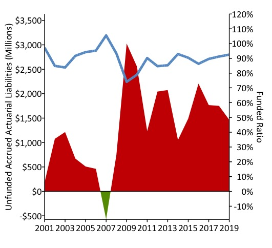
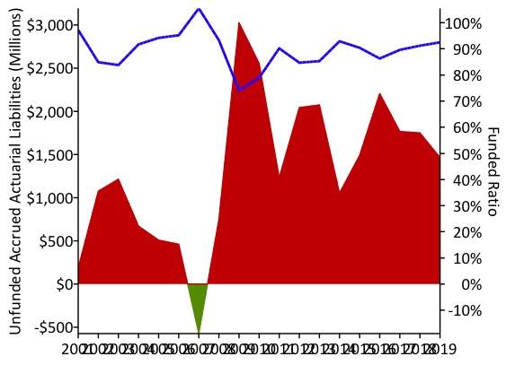

```{r setup, include=FALSE}
knitr::opts_chunk$set(echo = TRUE)
```

## R Markdown

This is an R Markdown document that describes Reason graphics style in R.
Packages: `pensionviewr` & `reasonTheme`

##Defining
- Colors
- ggplot() themes, labels, and margins

```{r, out.length = "100px", out.width = "200px"}

# All images should use web safe colors — this gives us a range of orange and blue
# colors that fit with Reason’s branding, as well as reds and greens that we can use to
# indicate positive or negative data patterns. The following colors are most suitable:
#https://www.rapidtables.com/web/color/Web_Safe.html

palette_reason <- data.frame(
  Orange = "#FF6633", 
  LightOrange = "#FF9933",
  DarkGrey = "#333333", 
  SpaceGrey = "#A69FA1",
  DarkBlue = "#0066CC",
  GreyBlue = "#6699CC", 
  Yellow = "#FFCC33", 
  LightBlue = "#66B2FF", 
  SatBlue = "#3366CC", 
  Green = "#669900",
  LightGreen = "#00CC66",
  Red = "#CC0000",
  LightRed = "#FF0000")

##Convert color code to RedGreenBlue palette (with rgb())
rgb1 <- col2rgb(palette_reason$SatBlue, alpha = FALSE)/255
rgb1
rownames(rgb1) <- c("red", "green", "blue")
ColorName <- rgb(rgb1[1],rgb1[2],rgb1[3])
ColorName
#Customize color code
ColorName2 <- rgb(0.1,0.5,0.8)
ColorName2

#######
for (i in (1:length(palette_reason))){
x <- plot(c(5, 10), c(15, 30), type= "n", main=c(colnames(palette_reason[i])), xlab = "", 
ylab = c(as.character(palette_reason[1,i])), xaxt="n", yaxt="n",cex.lab=1.5, cex.main=2)
rect(5, 15, 10, 30, col = as.character(palette_reason[1,i]), border = "transparent")
## Standard Colors for graphics in R
}
```

# Standardized R parameters:

### Base R package: ggplot2 (main parts)
- geometry (ex: line, bar, point, text)
- scale (ex: x-axis, y-axis, color, shape)
- mapping of data to scales (ex: car type maps to the x-axis)
- theme (ex: title font, caption color)

### Base Font: "Calibri"
### Base Font size: 14.0
### Base Line size: 0.5
### Base Theme: reasonTheme (
     #plot.title (size = base_size * 12 / 8.5, margin = ggplot2::margin(b = 10L))
     #plot.margin (t = half_line,
                                  r = base_line_size * 24,
                                  b = half_line,
                                  l = half_line)
     #axis.title(face = "bold", size = base_size)
     #axis.title.x(margin = ggplot2::margin(t = 8L))
     #axis.title.y(angle = 90L,margin = ggplot2::margin(r = 4L))
     #axis.ticks.length(4L, "pt")
      
                    
### What you have to specify in ggplot(), after setting Reason theme, when you graph somthing in R: 
 - Data to use for the graph (data.frame)
 - Y-axis & X-axis scales (`ticks = n`)
 - Y-axis & X-axis limits (`limits = c(x,y)`)
 - Colors (`color =` or `fill =`, using colors in `palette_reason`)
 - Title (`ggtitle()`)

## Latest Mountain of Debt Plot using deptPlot() from `pensionviewr`
### Modified colors, ending ticks & year labels
  

## Original Mountain of Debt Plot using deptPlot() from `pensionviewr`
  
  
  
```{r, echo=FALSE}
```