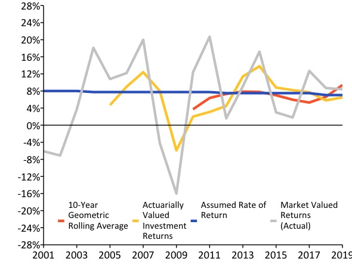

```{r setup, include=FALSE}
knitr::opts_chunk$set(
  echo = FALSE,
  message = FALSE,
  warning = FALSE,
  #dev = "svg",
  fig.width = 12,
  fig.height = 7
)
```


### A History of Weakening Solvency (2001-2019) w/ R Code
```{r debt, fig.width=8, fig.height=5, fig.align = "center", message=FALSE, warning=FALSE}

rm(list=ls())
###Load/install packages
#R.Version()
#https://github.com/ReasonFoundation/pensionviewr
#Create token -> usethis::edit_r_environ() -> restart -> Sys.getenv("GITHUB_PAT")
#install.packages('devtools')
#library(devtools)
#devtools::install_github("ReasonFoundation/reasontheme",force = TRUE)
#devtools::install_github("ReasonFoundation/pensionviewr", force = TRUE)
library(reasontheme)
library(pensionviewr)
library(ggplot2)
library(tidyverse)
library(tseries)
library(data.table)
library(readr)
library(rsconnect)
library(dplyr)
library(plyr)

#reason_color_pal()
#library(extrafont)
#font_import(pattern="Roboto")
#loadfonts(device = "win", quiet = TRUE)
##Palette
#https://www.rapidtables.com/web/color/Web_Safe.html
#https://www.colorbook.io/hexcolors/view/A69FA1

#rgb1 <- col2rgb(palette_reason$Yellow)/255
#rownames(rgb1) <- c("red", "green", "blue")
#rgb1
#Custom color code
#ColorName <- rgb(0.2,0.2,0.4)
#ColorName  

###
##Pull PERSI data
##Load list of plans
pl <- planList()

#PULL DATA
Data <- pullStateData(2001)
Data <- filterData(Data,2001)
#View(Data)
PERSI.debt <- Data %>% filter(plan_name == "Idaho Public Employee Retirement System")
PERSI.debt$year <- as.numeric(PERSI.debt$year)
PERSI.debt$ava <- as.numeric(PERSI.debt$ava)
PERSI.debt$aal <- as.numeric(PERSI.debt$aal)
#Set to data.frame for visualization
PERSI.debt <- data.table(PERSI.debt)
PERSI.debt[,uaal := aal-ava]
###########
#set reasontheme
set_reason_theme(style = "slide")

####Edit detPlot() manually
############
debtPlot <- function(data, title = NULL, caption = FALSE, grid = FALSE, ticks = TRUE, font) {
  
  data <- data %>%
    dplyr::filter(data$uaal != 0)
  # extrapolate between years linearly
  extrapo <- stats::approx(data$year, data$uaal,  n = 10000)
  extrapo2 <- stats::approx(data$year, data$funded_ratio, n = 10000)
  graph <-
    data.frame(year = extrapo$x,
               uaal = extrapo$y,
               funded_ratio = extrapo2$y) %>%
    tidyr::drop_na()
  graph <- graph %>%
    dplyr::mutate(sign = dplyr::case_when(.data$uaal >= 0 ~ "positive",
                                          .data$uaal < 0 ~ "negative"))
  
  y_minimum <- min(graph$uaal)
  y_maximum <- max(graph$uaal)
  ggplot2::ggplot(graph,
                  ggplot2::aes(x = graph$year)) +
    ggplot2::geom_area(ggplot2::aes(y = graph$uaal, fill = graph$sign)) +#Removed "color" parameter
    ggplot2::geom_line(ggplot2::aes(y = graph$funded_ratio * (y_maximum)),
                       color = palette_reason$GreyBlue,#Referenced Color Palette
                       size = 1.5) +#Increased Size 1.
    #ggtitle(title)+
    # axis labels
    ggplot2::labs(y = "Unfunded Accrued Actuarial Liabilities (Millions)", x = NULL) +
    
    # colors assigned to pos, neg
    ggplot2::scale_fill_manual(
      values = c("negative" = paste(palette_reason$Green),#Referenced Color Palette
                 "positive" = paste(palette_reason$Red)),#Referenced Color Palette
      aesthetics = c("colour", "fill")
    ) +
    # sets the y-axis scale
    ggplot2::scale_y_continuous(
      # creates 10 break points for labels
      breaks = scales::pretty_breaks(n = 10),
      # changes the format to be dollars, without cents, scaled to be in billions
      labels = scales::dollar_format(
        prefix = "$",
        scale = (1e-6),
        largest_with_cents = 1,
      ), 
      limits = c(y_minimum, y_maximum*1.2),
      # defines the right side y-axis as a transformation of the left side axis, maximum UAAL = 100%, sets the breaks, labels
      sec.axis = ggplot2::sec_axis(
        ~ . / (y_maximum / 100),
        breaks = scales::pretty_breaks(n = 10),
        name = "Funded Ratio",
        #set limits
        labels = function(b) {
          paste0(round(b, 0), "%")
        }
      ),
      # removes the extra space so the fill is at the origin
      expand = c(0, 0)
    )+
    geom_hline(yintercept=0, linetype="solid", color = "black", size = 0.5)+
   ##Adding titles & caption
    labs(title = paste(title), 
         caption = ifelse(isTRUE(caption),paste("reason.org/pensions"),paste(""))
    )+
    ggplot2::theme(axis.ticks = if(isFALSE(ticks)){ggplot2::element_blank()}else{ggplot2::element_line()}
                   )+
    ggplot2::theme(axis.ticks.x = element_line(size = 0.5, color="black"))+
    ggplot2::theme(axis.ticks.y = element_line(size = 0.5, color="black"))+
    ggplot2::theme(axis.text=element_text(size=12),
        axis.title=element_text(size=12,face="bold"))+
   # coord_cartesian(ylim=(c(y_minimum, y_maximum*1.2)))+##Added limits
    coord_cartesian(expand = FALSE, #turn off axis expansion (padding)
                    xlim = c(2001, 2019), ylim = c(y_minimum, y_maximum*1.2))+ #manually set limits
    # sets the x-axis scale
    ggplot2::scale_x_continuous(breaks = round(seq(min(graph$year), max(graph$year), by = 2), 1),
                                expand = c(0, 0)) +#Added blanck ticks to x-axis
    
    ggplot2::theme(legend.position = "none")+
    ggplot2::theme(text = element_text(family = paste(font), size = 9))+ 
    ##Adding Gridlines
    ggplot2::theme(panel.grid.major.y = element_line(colour= ifelse(isTRUE(grid), 
                           paste(palette_reason$SpaceGrey),"white"),size = (1)))
}
##Plot graph
#debt.plot  <- debtPlot(PERSI.debt,font = "Calibri")
#savePlot(debt.plot, source = "Source: PIP", save_filepath = "/Users/anilniraula/Downloads/test.png",
#width_pixels = 600, height_pixels = 400)
#With Title, caption and grid
#debtPlot(PERSI.debt, "Idaho PERS Pension Debt", caption = TRUE, grid = TRUE, ticks = TRUE, font = "Verdana")

debt <- debtPlot(PERSI.debt, caption = F, grid = F, ticks = F,font = "Calibri")

debt
```

### A History of Investment Returns (2001-2019) w/ R Code
```{r graph, fig.width=8, fig.height=5, fig.align = "center", message=FALSE, warning=FALSE}
### linePlot ###
## Data: Database + Manual(AVA returns)
## Base: linePlot() function in `pensionviewr`
# By: Anil, Swaroop, and Jen


##linePlot() function parameters:

#data = data in data.frame, tibble, or data.table format,
#yaxisMin & yaxisMax = Y-axis mininum and maximum values
#yaxisSeq = set sequency of Major breaks
#yaxisScale = 100 for percentages
#format = set Y-axis format to either "%", "$", or empty
#str = set number of srings at which to cut legend text (default is 20),
#labelY = title of Y-axis,
#lab1 - lab5 = character string of line titles/names (default is 0 Lines)

rm(list=ls())
library(reasontheme)
library(pensionviewr)
#library(janitor)
library(grid)#https://bookdown.org/rdpeng/RProgDA/the-grid-package.html
library(tidyverse)
#library(openxlsx)
library(tseries)
library(plyr)
#library(ggplot2)
library(data.table)
library(openxlsx)
#library(readr)
library(rsconnect)
library(base64enc)
#Shiny-----------
library(shiny)
library(shinyWidgets)
#library(shinyFiles)
library(DT)
library(plotly)
library(rlang)
library(purrr)

###################
#Using 2 New Functions to download and filter datat from datatabase
PERSI.data <- pullStateData(2001)
PERSI.data <- filterData(PERSI.data, 2001)

pl <- planList()
#filter for PERSI
PERSI.data<- PERSI.data %>% filter (plan_name == "Idaho Public Employee Retirement System")
#View(PERSI.data)

PERSI.data$year <- as.numeric(PERSI.data$year)
#Set to data.frame for visualization
PERSI.data <- data.frame(PERSI.data)
#View(PERSI.data)

# UAL4 <- data.table(UAL4[, Tr30 := tr30[(n-UAL4[!is.na(Actual_Return),.N]):last]])
###############
#Adding AVA returns (Arkansas ERS example*)
ava_returns <- matrix(0, 19,1)
ava_returns[,1] <- c(-0.064, -0.0736, 0.0332, 0.1763, 4.70, 9.00, 12.40, 8.00, -5.90, 2.00, 3.10, 4.50, 11.40, 13.80, 8.80, 8.20, 7.70, 5.80, 6.50)
#View(ava_returns)
ava_returns <- data.table(ava_returns/100)

PERSI.data <- data.table(PERSI.data)
PERSI.data <- PERSI.data[, ava_return := ava_returns]

PERSI.data$year <- as.numeric(PERSI.data$year)

PERSI.data <- data.frame(PERSI.data)

PERSI.data <- PERSI.data %>% select(year, return_1yr, ava_return, arr)


#####Modified linePlot

linePlot <- function(data, yaxisMin = 0, yaxisMax = NULL, yaxisSeq = 5,
                     yaxisScale = 100, format = NULL, str = 20,
                     labelY = NULL, lab1 = NULL, 
                     lab2 = NULL, lab3 = NULL, 
                     lab4 = NULL, lab5 = NULL) {
  
  reasontheme::set_reason_theme(style = "slide")
  
  data <- data.table(data) %>% dplyr::mutate_all(dplyr::funs(as.numeric))
  
  
if(sum(data$return_1yr)>0){  
  
  #####Adding GEOMEAN FUNCTION + CALCULATION if data contains "return_1yr" column
geomean <- function(x) {
  x <- as.vector(na.omit(x))
  x <- x +1
  exp(mean(log(x)))-1 
}
returns <- as.numeric(data$return_1yr)
nyear <- 10
rolling <- geomean(returns[1:nyear])
n <- length(na.omit(returns))-nyear
#Geomean function
for(i in 1:n){
  rolling <- rbind(rolling, geomean(returns[(i+1):(i+nyear)]))
}
rolling <- data.table(rolling)

data <- data.table(rbind.fill(rolling, data))
data[(data[!is.na(return_1yr),.N]+1):(data[!is.na(return_1yr),.N]+rolling[,.N])]$V1<- data[(1:rolling[,.N])]$V1
data <- data[!(1:rolling[,.N])]
data$year <- as.numeric(data$year)
}else{NULL}
  
  #Reshuffling column order per gemean calculated column named V1
  if(sum(data$return_1yr)>0){ data <- data %>% select(year, return_1yr, ava_return, arr, V1)}
  else{NULL}
  
  colnames(data) <- c("year", if(!is_null(lab1)){paste(lab1)},
                      if(!is_null(lab2)){paste(lab2)},
                      if(!is_null(lab3)){paste(lab3)},
                      if(!is_null(lab4)){paste(lab4)},
                      if(!is_null(lab5)){paste(lab5)})
  
  #Wide-to-Long format transformation for graphing
  graph <- data.table(melt(data, id.vars="year"))
  
  lineColors <- c(palette_reason$Orange,palette_reason$Yellow, palette_reason$SatBlue,    palette_reason$LightGrey) #Updated palette to reason one
  options(repr.plot.width = 1, repr.plot.height = 0.75)
  
  ggplot2::ggplot(graph, ggplot2::aes(x = year, y = yaxisScale * value, group = variable)) +
    ggplot2::geom_line(ggplot2::aes(colour = str_wrap(factor(variable), str)), size = 1.5) + #Added str_wrap(to cut legend text)
    ggplot2::geom_hline(yintercept = 0, color = "black") +
    ggplot2::scale_colour_manual(values = lineColors) +
    ggplot2::scale_y_continuous(
      breaks = seq(yaxisMin, if(!is.null(yaxisMax)){yaxisMax} #added automatic Y max calcualation
                                else{max(graph$value)*yaxisScale*1.2}, by=yaxisSeq), 
                   limits = c(yaxisMin,if(!is.null(yaxisMax)){yaxisMax}
                                else{max(graph$value)*yaxisScale*1.2}), #added limits and expanded break scale
      labels = function(b) {
        if(format == "%"){
          paste0(round(b, 0), "%")
        }else if(format == "$"){#Adding "$" format
          paste0("$", round(b, 0))
        }else{
          paste0(round(b, 0))}
      },
      expand = c(0, 0)
    ) +
    
    ggplot2::scale_x_continuous(breaks = seq(min(graph$year), max(graph$year), by = 2), #added blank years
                                expand = c(0, 0)
    ) +
    
    labs(x = element_blank(), y = labelY)+
    theme(legend.text=element_text(size=13))+ #Added element to control legend font size
    theme(legend.direction = "vertical", #changing legend direction to "vertical"
                legend.box = "horizontal",
                legend.position= c(0.33, 0.09)) #Moved legend to the bottom
}

graph <- linePlot(PERSI.data, yaxisMin = -21, yaxisMax = 21, yaxisSeq = 3,
                  yaxisScale = 100, format = "%", str = 60,
                  labelY = "", lab1 = "Market Valued Returns (Actual)", 
                  lab2 = "Actuarially Valued Investment Return (Smoothed by Plan)", 
                  lab3 = "Assumed Rate of Return", 
                  lab4 = "10-Year Geometric Rolling Average", lab5 = NULL)

#Example w/ AVA vs. AAL
#PERSI.data <- PERSI.data %>% select(year, ava, aal)
#graph <- linePlot(PERSI.data, yaxisMin = 0, yaxisMax = 21, yaxisSeq = 3,
#                  yaxisScale = 1/1000000000, format = "$", str = 60,
#                  labelY = "AVA vs. AAL", lab1 = "Actuarial Value of Assets", 
#                  lab2 = "Actuarial Accrued Liabilities")


graph
```

### Negative Amortization Growth w/ R Code
```{r neg.amo, fig.width=8, fig.height=5, fig.align = "center", message=FALSE, warning=FALSE}

rm(list=ls())

library(reasontheme)
library(pensionviewr)
#library(janitor)
library(grid)#https://bookdown.org/rdpeng/RProgDA/the-grid-package.html
library(tidyverse)
#library(openxlsx)
library(tseries)
library(plyr)
#library(ggplot2)
library(data.table)
library(openxlsx)
#library(readr)
library(rsconnect)
library(base64enc)
#Shiny-----------
library(DT)

# file paths and names of files to read and save
#####
urlfile <- "https://raw.githubusercontent.com/ReasonFoundation/GraphicsR/master/Idaho%20Amo%20Data.csv"
NegAmoData <- read_csv(url(urlfile), col_names = TRUE, na = c(""), skip_empty_rows = TRUE, col_types = NULL)
NegAmoData <- data.table(NegAmoData)
NegAmoData <- NegAmoData[2:nrow(NegAmoData),]
year <- NegAmoData[,1]
NegAmo <- NegAmoData[,2]
NegAmoDef <- NegAmoData[,3]
NegAmoExcess <- NegAmoData[,4]
PlotDataAmo <- data.frame(year,'Contributions',NegAmo)
PlotDataDef <- data.frame(year,'Deficiency',NegAmoDef)
PlotDataExcess <- data.frame(year,'Excess',NegAmoExcess)

colnames(PlotDataAmo) <- c('year','type','value')
colnames(PlotDataDef) <- c('year','type','value')
colnames(PlotDataExcess) <- c('year','type','value')

PlotData <- rbind(PlotDataAmo,PlotDataDef,PlotDataExcess)
names <- data.frame(PlotData[,2])
value <- PlotData[,3]

#savename <- "contributions2.pdf"
#filesave <- file.path("D:", "explica??es", "Genia", savename)
# data needs to be loaded with the following columns: 
# year, 25-50, median, not_important1, not_important2, 50-75
# get it into a dataframe format

data_perc <- data.frame(NegAmoData)
# get all the data in numeric format
data_perc[, c(1:8)] <- sapply(data_perc[, c(1:8)],function(x){as.numeric(gsub(",", "", x))})
data_perc[, c(2:8)] <- sapply(data_perc[, c(2:8)],function(x){x/1000000})
data_perc[is.na(data_perc)] = 0

#check if the mode of each column in the dataframe is numeric 
#sapply(data_perc, mode)
#View(data_perc)
# theme plot parameters
plotTheme <- ggplot2::theme(   
  panel.grid.major = element_blank(),
  panel.grid.major.y = element_line(colour = "gray"),
  panel.grid.minor = element_blank(), 
  axis.line = element_line(colour = "black"),
  plot.margin = margin(0, 0,0,0, "cm"),
  axis.text.y = element_text(size=11, color = "black"),
  axis.text.x = element_text(size=11, color = "black", angle = 0, hjust = 0.5, vjust = 0.5),
  legend.title = element_text(size = 11, colour = "white", face = "bold"))

# width of the bars in years: 0.5 will give no spaces between bars 
widthx <- 0.2
alphalevel <- 0.7
# vector with the coordinates for the geom_rect: Xmin, xmax, ymin and ymax for each year
x <- data.frame(data_perc[, c(1)]-widthx, data_perc[, c(1)]+widthx, 0,data_perc[, c(2)] )
x2 <- data.frame(data_perc[, c(1)]-widthx, data_perc[, c(1)]+widthx, -1*data_perc[, c(3)], 0 )
x3 <- data.frame(data_perc[, c(1)]-widthx, data_perc[, c(1)]+widthx, data_perc[, c(2)],data_perc[, c(2)]+data_perc[, c(4)] )
ymax <- ceiling(max(data_perc[, c(2)]+data_perc[, c(4)]))
ymin <- ceiling(min(x2[, c(3)]))
# added inside the scale_y_continuous the limits=c(ymin, ymax) to control the y limits
neg.amo <- ggplot() + 
  scale_x_continuous(name="year", breaks = seq(min(data_perc$Year), max(data_perc$Year), by = 2)) + 
  scale_y_continuous(
    breaks = scales::pretty_breaks(n = 5), 
    name="(Millions)",
    # removes the extra space so the fill is at the origin
    #expand = c(0, 0)
    ) +
  # this is used to build the bars alpha is opacity of the bars
  geom_rect(data=x2, mapping=aes(xmin=x2[,1], xmax=x2[,2], ymin=x2[,3], ymax=x2[,4]), fill="red", alpha=alphalevel) +
  geom_rect(data=x2, mapping=aes(xmin=x3[,1], xmax=x3[,2], ymin=x3[,3], ymax=x3[,4]), fill="green", alpha=alphalevel) +
  geom_rect(data=x, mapping=aes(xmin=x[,1], xmax=x[,2], ymin=x[,3], ymax=x[,4]), fill="gray", alpha=alphalevel) +
  # be careful because wit the names of the columns in the data_perc, they must match
  ##geom_line(data = data_perc, aes(X1, X2), size=2, color="orange")+
  theme_bw()+
  plotTheme 

neg.amo
#ggsave(filesave)
```

### A Mountain fo Debt Plot w/ Saved Img


### A History of Weakening Solvency (2001-2019) w/ Saved Img


### References

- https://github.com/ReasonFoundation/GraphicsR </p>
- https://rstudio.com/wp-content/uploads/2015/03/rmarkdown-reference.pdf </p>
- https://bookdown.org/yihui/rmarkdown/